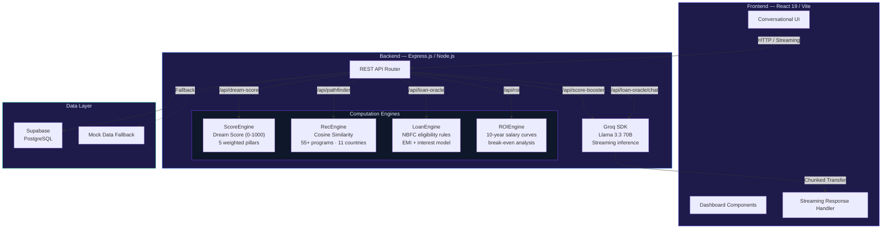

<div align="center">

# GradPath AI — Career Navigator

**AI-first study abroad platform with conversational university matching, loan advisory, and SOP generation — powered by Groq streaming inference on Llama 3.3 70B**


</div>

---

## The Problem

The study abroad process for Indian students is fragmented across dozens of disconnected tools — university shortlisting, loan comparison, SOP writing, timeline planning — each requiring separate research, accounts, and manual effort. There's no unified system that takes a student's profile and delivers end-to-end guidance in a single session.

GradPath AI consolidates four computation engines behind a single conversational interface, with Groq SDK streaming inference on Llama 3.3 70B enabling real-time SOP generation and multi-turn advisory. Built for TenzorX Hackathon 2025 and deployed as a split-stack application on Vercel (frontend) and Render (backend).

---

## What This Does

A full-stack intelligent platform that combines **university matching**, **loan advisory**, **SOP generation**, and **gamified profile scoring** into a conversational experience.

- **55+ university programs** across 11 countries indexed and queryable via cosine similarity
- **Real-time SOP generation** using chunked HTTP streaming from Groq SDK
- **Loan eligibility gating** with EMI simulation and break-even analysis
- **10-year ROI projection** for salary curves by field and geography
- **Dream Score** — gamified readiness metric (0–1000) across five weighted pillars

---

## System Architecture



---

## Tech Stack

| Layer | Technology | Version | Role |
|:---|:---|:---|:---|
| **Frontend** | React | 19 | UI components, state management |
| **Bundler** | Vite | 8 | Fast HMR, build tooling |
| **Backend** | Express.js | 4.x | REST API, streaming response handler |
| **Runtime** | Node.js | 18+ | Server-side JavaScript execution |
| **LLM** | Groq SDK → Llama 3.3 70B | — | SOP generation, conversational loan advisory |
| **Database** | Supabase (PostgreSQL) | — | User profiles, session data (optional) |
| **Frontend Hosting** | Vercel | — | Edge-deployed frontend |
| **Backend Hosting** | Render | — | API server deployment |

---

## Feature Modules

| Module | What It Does | Under the Hood |
|:---|:---|:---|
| **PathFinder** | Profile-to-university matching | Cosine similarity over a 55-program dataset → Groq-powered admit-probability reasoning per match |
| **LoanOracle** | Multi-turn conversational loan advisor | Stateful sessions with in-memory storage → eligibility gating via `LoanEngine` → pre-filled confirmation flow |
| **ScoreBooster** | Live SOP generation with AI review | Groq SDK streaming (chunked HTTP transfer) → follow-up review returning structured feedback |
| **GrowthEngine** | Autonomous engagement loop | WhatsApp-style nudges, AI blog content, and real-time platform metrics |
| **Dream Score** | Gamified readiness metric (0–1000) | Computed across academic strength, financial readiness, profile completeness, target alignment, and application progress |
| **Referral System** | Score-based referral rewards | Unique code generation with progress tracking and score-linked bonuses |

---

## Getting Started

### Prerequisites
- Node.js 18+
- Groq API Key ([console.groq.com](https://console.groq.com))
- Supabase project (optional — falls back to mock data)

### Installation

```bash
# Clone the repository
git clone https://github.com/Hazz-Y/GradPath-AI-Career-Navigator.git
cd GradPath-AI-Career-Navigator

# Backend setup
cd server
npm install
cp .env.example .env
# Add your GROQ_API_KEY and SUPABASE_URL to .env

# Start the backend
npm run dev
# → http://localhost:3001

# Frontend setup (new terminal)
cd ../client
npm install

# Start the frontend
npm run dev
# → http://localhost:5173
```

### Environment Variables

| Variable | Required | Description |
|:---|:---|:---|
| `GROQ_API_KEY` | Yes | Groq API key for Llama 3.3 70B inference |
| `SUPABASE_URL` | Optional | Supabase project URL |
| `SUPABASE_ANON_KEY` | Optional | Supabase anonymous key |

---

## Project Structure

```
GradPath-AI-Career-Navigator/
├── client/                    # React 19 + Vite frontend
│   ├── src/
│   │   ├── components/        # UI components per module
│   │   ├── pages/             # Route-level views
│   │   ├── services/          # API client + streaming handlers
│   │   └── utils/             # Scoring, formatting helpers
│   └── vite.config.js
├── server/                    # Express.js backend
│   ├── routes/                # API route handlers
│   ├── engines/               # ScoreEngine, RecEngine, LoanEngine, ROIEngine
│   ├── data/                  # University dataset (JSON), loan rules
│   ├── middleware/            # Auth, error handling, CORS
│   └── index.js
└── README.md
```

---

## Deployment

| Service | URL | Stack |
|:---|:---|:---|
| Frontend | [Vercel](https://vercel.com) | React 19 / Vite — Edge CDN |
| Backend | [Render](https://render.com) | Express.js — Managed Node.js |

Streaming responses from the Groq SDK are piped directly to the client via chunked HTTP transfer encoding, enabling real-time SOP generation and conversational output without buffering the full LLM response.

---

## License

MIT — see [LICENSE](LICENSE) for details.
